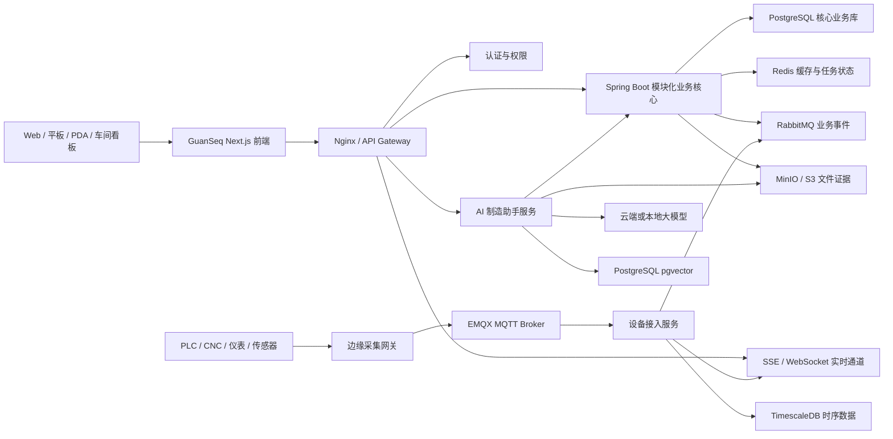

# GuanSeq 系统总体架构与开发蓝图

> 文档状态：目标架构基线  
> 更新日期：2026-08-28
> 适用范围：GuanSeq 前端、业务后端、数据、物联网、AI、集成、部署与运维

具体开发任务必须遵循 [开发规范与交付流程](./开发规范与交付流程.md)。已经接受的重大工程决策统一记录在 [架构决策记录（ADR）](./adr/README.md)；目标蓝图描述长期方向，不代表其中所有组件都应立即部署。

## 1. 文档定位

本文是 GuanSeq 后续产品设计和工程建设的总架构基线。它描述“最终要建设成什么”，同时明确当前已经实现的部分，避免把规划能力误写成已交付能力。

当前前端产品基线已经收口，`guanseq-server` 后端已完成工程底座、组织/工作区、当前工作区成员与受控角色、客户和物料主数据，以及订单到交付、基础收付款和利润等核心纵向闭环。V48 已补齐销售退货授权、待检收货、质量拆分、取消/冲回以及毛发货/累计退货/净发货事实；V49 已补齐采购退货授权、原批次退回出库、取消/冲回、毛合格收货/累计合格退货/净合格收货和应付复核标记，销售与采购反向实物流均进入正式服务。V50—V51 已完成采购移动扫码收货、来源审计、稳定幂等草稿及退货后按净收货补收的数据库约束，扫码继续复用采购、质量和库存正式事实。设备阶段已完成台账/人工状态、维护/备件/成本/周期任务、可替换 Modbus TCP 与外部 MQTT 3.1.1 Broker 只读采集、有限样本生命周期、结构化技术预检、基础报警责任和人工核实 OEE/停机审核。V47 建立真实端点现场验收单，只有最新现场候选预检和网络、安全、只读、恢复、容量、映射六项证据通过独立审批后才形成“现场已验收”；模拟器由后端拒绝验收。阶段 D 已完成开源工程闭环，但每个安装实例仍须取得真实设备或用户 Broker 证据完成自己的上线验收。GuanSeq 不内置或强制 EMQX，也不把仿真或稀疏遥测冒充自动 OEE。OPC UA、自动 OEE、边缘网关、远程控制和高级报警策略属于按需增强。生产、销售和采购履约已形成可追溯证据链，正向收付款进入应收应付财务事实；完整 IAM、总账、生产移动作业和其他尚未落地能力不得被宣称已完成。

2026-08-28 状态增量：V52 已完成生产领料移动扫码、精确库存余额/版本校验以及来源/批次证据；V53 已完成生产扫码开工、工序完工、最后工序报工和自动送检，并固化认证操作人、精确工序与来源证据；V54 已完成工序、本人和库存三类受控标签首次生成与补打，固定 Code 128B 载荷、模板版本、原因、责任和请求幂等，并明确 `PREPARED` 不等于物理出纸成功；V55 已完成仓储收货上架与库内扫码；V56 已完成同仓正式库位调拨和单余额盘点，以开放任务额度、账面快照、余额版本、固定顺序锁、差异审批、不可变流水和补偿冲回保证数量守恒。所有扫码与标签能力均复用既有正式事实，不依赖专用 PDA 或 Broker。

架构状态分为：

- **当前已有**：代码中已存在并可运行。
- **近期建设**：第一条业务闭环所必需的能力。
- **后续规划**：已进入产品地图，但不属于当前已交付范围。
- **按需演进**：只有达到明确规模或复杂度阈值后才引入。

## 2. 产品定位与边界

GuanSeq 是面向普通制造企业的一体化制造运营平台。用户看到一套产品、一个工作台、一套主数据，内部保持清晰的领域事实边界：

- ERP：销售、采购、计划、结算与成本。
- MES：生产订单、工序执行、报工、在制品和追溯。
- WMS：仓库、库位、批次、库存移动、领退料和盘点。
- QMS：质量标准、检验、不合格、改进和质量追溯。
- PLM/PDM：物料、BOM、图纸、工艺路线和工程变更。
- APS：产能负荷、约束与高级排程。
- EAM：设备台账、点检、保养、维修、备件和设备采集。
- BI/AI：经营分析、风险识别、知识检索和智能辅助。

GuanSeq 不在第一阶段追求大型集团财务、全功能 PLM 或重型 APS，也不把所有工业协议塞入业务核心。

## 3. 第一条业务闭环

```text
销售订单
→ 交付承诺
→ 主生产计划 / MRP
→ 采购与生产备料
→ 生产订单 / 车间工单
→ 派工、领料、工序执行与报工
→ 过程检验 / 完工检验
→ 完工入库
→ 拣货、装箱、发货与签收
→ 应收应付、制造成本与订单利润
```

所有新增功能应说明它服务于哪个业务节点、拥有哪些事实、产生哪些证据，以及如何进入审计和追溯链。

## 4. 产品栏目与功能地图

当前产品代码定义了 12 个一级栏目、120 个二级模块、97 个三级页面，共 236 条稳定产品路径。下面以 `src/lib/product-navigation.ts` 为事实来源。

### 4.1 经营工作台

- 经营总览
- 我的工作
  - 我的待办
  - 我的审批
  - 我的发起
  - 我的关注
- 业务流程
- 风险中心

### 4.2 销售管理

- 客户
  - 客户列表
  - 联系人
  - 信用资料
- 报价
- 销售订单
  - 订单列表
  - 订单审核
  - 变更记录
- 发货计划
  - 待发货
  - 交付跟踪
- 销售退货

### 4.3 采购与供应

- 供应商
- 采购申请
- 采购订单
- 到货协同
- 采购退货
- 供应商绩效
- 委外加工

### 4.4 产品与工艺

- 物料档案
  - 物料列表
  - 分类与属性
  - 计量单位
- 产品结构视图
- BOM 版本
  - BOM 列表
  - 版本比较
  - 替代料
- 工艺路线
  - 路线列表
  - 工序库
  - 作业指导书
- 图纸与文档
  - 受控图纸
  - 技术文件
  - 文档发布
- 工程变更（后续规划）

### 4.5 计划管理

- 主生产计划
- MRP 运算
  - 运算方案
  - 运算记录
  - 供需建议
- 物料齐套
- 产能负荷
- 高级排程（后续规划）

### 4.6 生产管理

- 生产订单
  - 订单列表
  - 下达记录
- 车间工单
  - 工单看板
  - 工序任务
- 派工与报工
  - 派工队列
  - 生产报工
  - 报工审核
- 在制品
- 生产追溯
  - 批次追溯
  - 序列号追溯
- 异常管理
  - 异常记录
  - 返工返修
  - 报废处置
- 车间移动作业
  - 扫码领料
  - 扫码报工
  - 标签补打

### 4.7 仓储物流

- 库存总览
  - 现存量
  - 可用量
  - 库存台账
- 收货上架
- 销售发货
  - 待拣货
  - 复核装箱
  - 出库交接
  - 签收回单
- 生产备料
- 领退料
- 成品入库
- 库存作业
  - 库存调拨
  - 库存调整
  - 冻结解冻
  - 其他出入库
- 条码与标签
  - 标签模板
  - 标签打印
  - 扫码作业
- 盘点作业

### 4.8 质量管理

- 质量标准
- 来料检验
  - 待检任务
  - 检验记录
- 过程检验
- 完工检验
- 不合格品
  - 不合格记录
  - 评审处置
  - 纠正措施
- 量检具管理
  - 量检具台账
  - 校准计划
- 客诉与改进
  - 客诉记录
  - 8D 改进
- 质量追溯

### 4.9 设备与资产

- 设备台账与人工运行状态（已接入真实 API）
- 一次性点检计划与执行（已接入真实 API）
- 一次性预防性保养与执行（已接入真实 API）
- 故障报修、维修工单与验收（已接入真实 API）
- 周期点检/保养模板、人工到期生成与逾期证据（已接入真实 API）
- 维修备件领退与运维成本证据（已接入真实 API）
- 工装模具（后续规划）
- Modbus TCP 只读采集（代码、标准协议仿真、数据库集成与浏览器闭环已验证；真实现场待验收）

### 4.10 成本与结算

- 应收管理
- 销售开票与收款
  - 销售开票
  - 收款核销
  - 客户对账
- 应付管理
- 采购发票与付款
  - 采购发票
  - 付款核销
  - 供应商对账
- 材料成本
- 制造成本
- 订单利润
- 总账税务（后续规划）

### 4.11 数据分析

- 经营分析
- 生产看板
- 质量分析
- 交付分析
- 自定义报表（后续规划）

### 4.12 系统管理

- 基础资料
  - 工厂与车间
  - 工作中心
  - 班次与日历
  - 仓库与库位
  - 业务原因码
- 组织与用户
  - 组织架构（当前为产品目录/Mock，后续受控切片）
  - 用户管理（已接入当前工作区成员、受控角色与访问状态真实 API）
  - 岗位管理（当前为产品目录/Mock）
- 角色权限（受控内置角色与后端显式角色门禁已形成管理员只读矩阵；动态角色与组合权限后续规划）
- 审批流程
- 编号规则
- 操作审计
- 开放接口（后续规划）

明确标记为后续规划的 5 个模块是：工程变更、高级排程、总账税务、自定义报表、开放接口。设备采集已进入受限工程验证状态，Modbus TCP 与外部 MQTT 3.1.1 Broker 只读适配、技术预检、基础报警责任和人工核实 OEE/停机审核已经完成代码和业务闭环；OPC UA、自动 OEE 来源与维护联动、远程控制、高级报警策略以及真实现场验收仍是后续切片。

## 5. 架构原则

1. **先模块化单体，后按证据拆服务**：第一阶段不直接建设大规模 Spring Cloud 微服务。
2. **一个事实只有一个所有者**：库存、成本、质量、工单等事实只能由归属模块写入。
3. **强事务留在模块内**：跨模块使用领域事件和可靠消息，不构建跨服务分布式事务。
4. **前端不直连数据库和 MQTT**：所有访问经过认证、授权和审计的 API。
5. **业务数据与高频设备数据分离**：核心业务库不承载原始高频点位流。
6. **操作有证据、变更可追溯**：业务取消、反审核和冲销优先于物理删除。
7. **现场可运行优先**：支持工厂本地部署、边缘断网缓存和恢复补传。
8. **AI 只做受控辅助**：高风险业务动作必须由人确认，所有建议必须可解释、可追溯。
9. **写模型与读模型适度分离**：交易写入坚持领域规则，复杂看板和报表使用受控读模型，不让统计查询破坏生产事务性能。

## 6. 总体技术架构

下图描述按条件演进的长期拓扑，不是当前部署清单。当前批准并已采用的是 Next.js、Spring Boot/Spring Modulith、PostgreSQL 与 Flyway；图中的网关、缓存、消息、对象存储、AI、边缘、Broker、独立 IoT 和时序组件均需由具体业务证据与 ADR 批准。



## 7. 技术选择目录

本表同时记录当前采用项与候选演进项。当前批准组件以 AGENTS.md 和已接受 ADR 为准；任何尚未采用的中间件、独立服务或部署组件不能仅凭本表进入实现。

| 层级 | 选择 | 使用原则 |
|---|---|---|
| Web 前端 | Next.js、React、TypeScript | 延续当前工程，不重写已有页面 |
| 服务端状态 | TanStack Query | 统一加载、缓存、错误和刷新语义 |
| 表格 | TanStack Table | 服务端分页、排序、筛选 |
| 表单与契约 | React Hook Form、Zod | 前后端契约一致，不依赖页面临时校验 |
| 轻量客户端状态 | Zustand | 仅保存界面状态，不复制服务端事实 |
| 业务后端 | Java LTS、Spring Boot | 统一事务、领域服务与 OpenAPI |
| 模块治理 | Spring Modulith | 约束依赖方向、验证模块边界 |
| 持久化 | Spring Data JDBC/JPA 或 MyBatis | 按模块复杂度选择，不混成无边界数据层 |
| 数据迁移 | Flyway | 每个业务模块拥有自己的迁移脚本 |
| 核心数据库 | PostgreSQL | 业务事实、账本、审计与结构化数据 |
| 缓存 | Redis | 缓存、会话、幂等键、短期状态 |
| 业务消息 | RabbitMQ | 跨模块异步事件、通知和后台任务 |
| 批处理调度 | Quartz 集群模式 | MRP、成本结转、报表和周期任务；第一阶段不额外部署调度平台 |
| 审批编排 | 轻量可配置审批模型 | 满足常规审核；出现复杂长流程后再评估 BPMN 引擎 |
| 设备消息 | 外部 MQTT Broker 适配器（按现场证据） | 原生 MQTT 设备或网关可接用户已有 Broker；不把 EMQX 设为默认依赖 |
| 时序数据 | PostgreSQL 起步，专用时序存储按容量证据 | 当前首机低频样本复用 PostgreSQL；真实写入与查询成本触发新 ADR 后再演进 |
| 文件 | MinIO / S3 | 图纸、附件、检验照片、签收与报告 |
| 实时推送 | SSE 优先、WebSocket 按需 | 看板推送与少量双向实时交互 |
| AI 检索 | PostgreSQL + pgvector | 初期不额外引入独立向量数据库 |
| 观测 | OpenTelemetry、Prometheus、Grafana、集中日志 | 指标、日志和链路使用统一关联 ID |
| 部署 | OCI 容器 | 兼顾工厂本地和云端部署 |

## 8. 前端架构

### 8.1 当前已有

- Next.js App Router、React、TypeScript 工程基线。
- 12 个一级栏目和 236 条产品路径。
- 一级、二级、按需三级导航和独立 URL。
- 统一圆润视觉、表格、分页、表单、自定义下拉、弹窗和抽屉。
- `src/services` 统一数据入口。
- Zod 运行时契约校验。
- 工作区、当前工作区成员、只读角色权限矩阵、客户、物料、BOM 版本、工艺路线版本、销售订单、独立需求、采购/生产订单、库存、MRP 净需求、生产报工、完工检验、设备台账、人工设备状态、点检、保养、维修工单、维修备件成本和周期维护生成页面使用真实 API Adapter。
- Mock 的异步提交、错误和状态语义。

### 8.2 目标分层

```text
路由页面
→ 业务场景组件
→ 领域 UI 组件
→ 查询 / 表单 hooks
→ src/services 领域服务
→ OpenAPI 生成客户端
→ GuanSeq API
```

页面不得直接读取散落 JSON，不得在组件内拼接后端 URL，不得通过全局状态复制订单、库存等服务端事实。

### 8.3 页面状态标准

每个正式页面必须覆盖：

- 初始加载、局部刷新和提交中状态。
- 空数据、无权限、接口失败和网络中断。
- 服务端分页、排序、筛选和批量选择。
- 创建、编辑、查看、审核、反审核、作废等明确业务状态。
- 操作结果反馈和可追踪请求编号。
- 键盘访问、焦点管理和基础无障碍语义。

## 9. 后端架构

### 9.1 第一阶段形态

后端采用 Spring Boot 模块化单体。模块部署在同一业务进程内，但代码、数据所有权、公开接口和事件必须隔离。Spring Cloud 不是第一阶段前置条件。

推荐代码结构：

```text
com.guanseq
├─ platform
├─ identity
├─ masterdata
├─ product
├─ sales
├─ planning
├─ procurement
├─ inventory
├─ production
├─ quality
├─ equipment
├─ finance
├─ analytics
└─ integration
```

每个模块内部使用：

```text
module
├─ api             对其他模块公开的命令、查询和事件
├─ application     用例编排、事务边界和权限校验
├─ domain          聚合、规则、值对象和领域服务
└─ infrastructure  数据库、消息和外部系统适配器
```

禁止其他模块直接引用 `infrastructure` 或直接修改不属于自己的表。

### 9.2 独立部署单元

当前批准并独立部署的主要应用单元是：

- `guanseq-web`：前端。
- `guanseq-server`：模块化业务核心。
- 基础设施：PostgreSQL；其余缓存、消息、对象存储按已批准业务切片引入。

`guanseq-iot`、`guanseq-ai`、EMQX、TimescaleDB、Redis、RabbitMQ 和 MinIO 都是候选演进项，不是当前默认部署清单；只有业务证据与被接受 ADR 才能把它们提升为正式组件。

## 10. 领域事实与模块所有权

| 领域 | 核心事实 | 主要输出事件 |
|---|---|---|
| 销售 | 客户、报价、销售订单、交付承诺 | 订单确认、订单变更、交付需求产生 |
| 计划 | 独立需求、MPS、MRP、计划建议 | 采购建议、生产建议、齐套风险 |
| 采购 | 供应商、采购申请、采购订单、到货 | 采购下达、到货、退货 |
| 库存 | 库存余额、批次、序列号、库存流水 | 入库、出库、调拨、冻结、盘点差异 |
| 生产 | 生产订单、工单、工序任务、报工、WIP | 开工、报工、完工、异常 |
| 质量 | 检验任务、检验记录、不合格、处置 | 合格放行、不合格、返工、报废建议 |
| 设备 | 设备、点检、保养、维修、停机 | 设备状态、维修完成、可用性变化 |
| 财务 | 应收、应付、成本层、订单利润 | 开票、核销、成本结转 |

库存余额不能直接手工覆盖，应由不可变库存流水汇总或校验得到。成本、追溯、审核记录同样保留可重放的业务证据。

## 11. 数据架构

### 11.1 核心数据库

PostgreSQL 保存业务事实。第一阶段使用一个数据库实例，按业务域划分 Schema 或严格表前缀；达到隔离或负载阈值后再拆实例。

核心业务表统一包含：

```text
id             全局业务标识
tenant_id      租户
company_id     法人公司
plant_id       工厂
business_no    人可读业务编号
status         业务状态
version        乐观锁版本
created_by     创建人
created_at     创建时间
updated_by     更新人
updated_at     更新时间
```

数据规则：

- 数量、金额、汇率使用定点数，禁止使用浮点数。
- 时间点统一保存 UTC，工厂日历和展示使用工厂时区。
- 业务编号与数据库主键分离。
- 主数据允许停用，不通过物理删除抹去历史引用。
- 已生效业务单据使用取消、冲销、反审核或新版本修正。
- 库存流水、报工、设备事件和审计日志按时间与工厂分区。
- 所有外部写入使用幂等键，避免重复回调和断网补传造成重复业务。
- BOM、工艺路线、质量标准使用受控版本、生效时间和变更原因，历史工单固定引用当时版本。
- 计量单位、换算关系和精度由主数据统一管理，数量换算保留原始值与业务值。
- 客户、供应商、物料等跨系统主数据保存外部系统标识映射，不用名称进行系统间匹配。

### 11.2 数据存储分工

| 数据类型 | 存储位置 |
|---|---|
| 订单、工单、库存、质量、成本 | PostgreSQL |
| 缓存、会话、短期锁、幂等键 | Redis |
| 高频设备点位和趋势 | TimescaleDB |
| 图纸、附件、照片、报告 | MinIO / S3 |
| AI 文档切片与向量 | PostgreSQL + pgvector |
| 搜索索引 | 初期 PostgreSQL；达到需求阈值后再引入 OpenSearch |

### 11.3 查询、报表与数据生命周期

- 操作页面读取面向用例的查询模型，不直接暴露数据库实体。
- 经营看板、齐套分析和订单履约视图使用 PostgreSQL 物化视图或专用读表，并通过事件增量更新。
- 大型报表不在生产事务请求中同步执行，采用后台任务生成并存入对象存储。
- 只有当读副本和 PostgreSQL 读模型无法满足已测量的分析负载时，才引入 ClickHouse 或独立数据仓库。
- 设备数据按原始、分钟聚合、小时聚合分层保留；保留周期由客户、点位类型和合规要求配置。
- 归档不等于删除，审计、质量和追溯数据必须遵守对应业务保留策略。

## 12. API 与集成

- 浏览器只访问 HTTPS API，不访问数据库、RabbitMQ 或 MQTT。
- 主业务 API 使用 REST，并由 OpenAPI 生成前端客户端和契约。
- 对外 API 使用明确版本，例如 `/api/v1`；兼容窗口内不得破坏已发布字段语义。
- 列表接口统一分页、筛选、排序和字段选择语义。
- 写接口支持幂等键、乐观锁和可追踪请求 ID。
- 批量导入采用“上传 → 校验 → 预览 → 确认 → 异步处理 → 结果报告”。
- 对外提供 OpenAPI、Webhook、文件交换和消息适配，不让外部系统直接写库。
- 外部回调先写入 Inbox 并完成签名、幂等和 Schema 校验，再进入业务用例。
- 实时看板优先使用 SSE；只有确实需要双向低延迟交互时使用 WebSocket。

## 13. 业务消息架构

RabbitMQ 负责业务异步消息，MQTT 只负责设备侧消息，两者不得混为同一消息总线。

业务事件示例：

```text
sales.order.confirmed
planning.mrp.completed
procurement.receipt.completed
inventory.stock.changed
production.operation.reported
quality.inspection.completed
equipment.alarm.raised
finance.cost.calculated
```

可靠性要求：

- 本地事务与 Outbox 同时提交。
- 消费者必须幂等。
- 明确重试、退避、死信和人工补偿机制。
- 消息携带 `event_id`、`tenant_id`、`plant_id`、`aggregate_id`、`aggregate_version`、`occurred_at`、`correlation_id` 和 Schema 版本。
- 同一聚合的事件使用稳定路由键保证可控顺序，消费者仍需处理乱序和重复。
- 事件只描述已发生事实，不用模糊事件替代业务命令。

## 14. 物联网架构

### 14.1 数据链路

当前已批准的最小链路：

```text
Modbus TCP 设备或标准协议仿真端点
→ guanseq-server equipment 协议适配器
→ PostgreSQL 连接/点位/样本
→ HTTPS 业务 API
```

原生 MQTT 设备或现场网关现已支持“用户已有外部 Broker → MQTT 适配器 → 同一统一样本模型”。下列边缘网关、独立 EMQX 部署、独立接入服务和专用时序库链路仅是达到网络隔离、离线缓存、连接规模或容量门禁后的候选目标，不是当前必装架构；MQTTS 则可直接使用当前适配器的 TLS 模式：

```text
PLC / CNC / 仪表 / 传感器
→ OPC UA / Modbus TCP / 厂商协议
→ 工厂边缘采集网关
→ MQTTS
→ EMQX
→ GuanSeq 设备接入服务
→ TimescaleDB / RabbitMQ / 实时推送
```

### 14.2 MQTT Topic 候选约定

```text
gs/{tenant}/{plant}/{device}/telemetry
gs/{tenant}/{plant}/{device}/status
gs/{tenant}/{plant}/{device}/alarm
gs/{tenant}/{plant}/{device}/event
gs/{tenant}/{plant}/{device}/command
gs/{tenant}/{plant}/{device}/command-reply
```

当前 MQTT 3.1.1 适配器以精确 Topic 和 JSON Pointer 映射进入统一样本模型；真实现场启用前仍必须用设备/网关 Schema 复核 Topic、消息编号、设备时间和点位值路径。质量、接收时间、连接和去重证据由 GuanSeq 统一记录，设备标识、质量码或消息版本可在后续经现场 Schema 证明后扩展。

### 14.3 现场可靠性

- 边缘网关必须支持断网缓存、恢复补传和重复消息去重。
- 设备、网关和服务器统一校时，并保留设备时间与接收时间。
- 设备身份使用独立凭据，生产环境使用 TLS，按 Topic 授权。
- 原始高频点位不直接写入核心 PostgreSQL。
- 点位采集频率、死区、聚合和保留周期在设备模板中配置，避免无价值数据无限增长。
- 设备报警转为业务事件前必须经过规则、抑制、去抖和级别归一化。
- 远程指令必须有权限、双向确认、超时、幂等和完整审计；高风险指令需要人工确认。
- 浏览器不直接连接生产 MQTT Broker。

## 15. AI 制造助手架构

AI 是独立辅助层，不是业务事实所有者。当前代码尚未接入 AI，以下为正式规划。

### 15.1 优先场景

1. 自然语言查询订单、库存、工单、质量和设备状态。
2. 缺料、延期、产能冲突和质量风险解释。
3. SOP、工艺文件、设备手册和历史案例知识检索。
4. 生产日报、质量周报和经营总结生成。
5. 异常处置建议和相似案例推荐。
6. 设备异常趋势与预测维护。
7. 文档、邮件、PDF 和图片中的业务信息提取。
8. 高级排程建议，最终排程仍由计划人员确认。

### 15.2 技术边界

```text
前端 AI 助手
→ guanseq-ai
→ 模型网关
→ 云端模型或工厂本地模型
→ pgvector 知识检索
→ 受权限控制的 GuanSeq 工具 API
```

- AI 不直接访问或修改数据库。
- AI 只能使用与当前用户相同或更小的数据权限。
- 每条业务判断显示事实来源、数据时间和推理置信信息。
- 新建工单、改计划、报废、发货、付款等动作必须人工确认。
- 模型输入输出、工具调用和确认人进入审计日志。
- 企业可按数据策略选择云端模型、本地模型或混合模型。
- 第一阶段使用 PostgreSQL `pgvector`，达到明确规模瓶颈后才评估独立向量数据库。

## 16. 身份、权限与审计

权限分为：

1. 功能权限：菜单、页面、按钮和 API。
2. 数据权限：租户、公司、工厂、车间、仓库和业务责任范围。
3. 字段权限：价格、成本、利润、工资和敏感联系方式。
4. 操作权限：创建、审核、反审核、作废、冲销、导入和导出。

安全要求：

- Spring Security 执行后端授权，前端隐藏按钮不能替代后端权限校验。
- 正式身份按 [ADR-0003](./adr/0003-OIDC正式身份接入.md) 使用 OIDC 授权码 + PKCE 与短时 JWT：Next.js BFF 保管令牌，Spring Boot 独立校验签名、签发者、受众和有效期。
- 外部用户名必须精确映射到贯序内部启用账号；外部角色不替代内部工作区、成员关系和业务授权，也不自动创建用户。
- 当前工作区成员管理按 [ADR-0005](./adr/0005-工作区成员与角色管理.md) 由 `ADMIN` 执行；用户与成员关系各自乐观锁，禁止自修改，所有开通、角色和状态动作进入审计。
- 受控内置角色和后端显式角色门禁通过管理员只读矩阵公开；目录一致性测试锁定各业务应用服务实际角色集合，矩阵没有权限写入能力，也不替代具体用例的对象、数据范围和状态校验。
- 浏览器只持有加密、HttpOnly、SameSite 会话 Cookie；前端脚本和本地存储不得接触访问令牌或客户端密钥。
- 重要操作支持再次确认或强化认证。
- 密钥、数据库口令和设备凭据不进入代码仓库。
- 外部接口使用独立客户端身份、最小权限、限流和签名校验。
- 审计日志记录操作者、时间、来源、对象、前后状态、请求 ID 和理由。
- 多租户查询必须自动注入租户边界，并通过集成测试验证越权不可达。
- 对高隔离客户支持独立数据库或独立部署；共享库模式可使用 PostgreSQL 行级安全作为纵深保护，但不能替代应用层授权。
- 构建产物生成 SBOM，依赖和容器镜像持续扫描，严重漏洞阻断发布。

## 17. 部署架构

### 17.1 试点与单工厂

- 当前已实现的最小生产基线使用 OCI 容器和 `compose.production.yaml`，部署 `guanseq-web`、`guanseq-server` 与 PostgreSQL。
- HTTPS 入口复用安装环境已有的反向代理、负载均衡器或云入口；Nginx 只是可选参考，不是强制依赖。
- Web 是唯一宿主入口且默认只绑定回环地址，后端和 PostgreSQL 只在内部网络可达；两个应用容器使用非 root、只读根文件系统和最小能力。
- PostgreSQL 是当前唯一持久化运行组件；生产配置、健康、升级、回退、备份与隔离恢复见[生产部署与恢复运行手册](./生产部署与恢复运行手册.md)和 [ADR-0008](./adr/0008-最小生产容器部署与外部TLS边界.md)。
- 当前低频只读 Modbus 切片继续复用 `guanseq-server` 与 PostgreSQL；MQTT 可先连接用户已有 Broker。只有现场隔离、离线缓存、连接规模或容量证据触发 ADR 时，才增加 EMQX、TimescaleDB 或独立 `guanseq-iot`。
- 开启 AI 时增加 `guanseq-ai` 和模型连接配置。

### 17.2 高可用与多工厂

- 应用无状态多副本。
- PostgreSQL 主备与自动备份恢复演练。
- Redis、RabbitMQ、EMQX 按可用性目标部署集群或托管实例。
- 对象存储启用版本、生命周期和异地副本。
- 工厂边缘网关在中心网络中断时继续采集和缓存。
- PDA 离线能力只用于经过授权的低风险扫码任务，并使用本地队列、幂等键和恢复后人工可见的同步结果；审核、付款和高风险库存调整不允许离线执行。

### 17.3 Spring Cloud 使用条件

只有满足以下一个或多个条件才拆分核心服务：

- 单模块需要独立扩缩容或独立发布。
- 团队已经按领域形成独立维护责任。
- 单体发布窗口影响多个工厂持续运行。
- 数据隔离或法规要求必须独立部署。
- 通过监控证明确有资源竞争或故障隔离问题。

拆分后再按实际部署环境选择 Spring Cloud Gateway、配置管理、服务调用和容错组件；如果运行在 Kubernetes 上，优先使用平台已有的服务发现和配置能力，避免重复建设。

## 18. 可观测性、备份与灾难恢复

- 所有 HTTP 请求、消息和设备事件贯穿统一 `correlation_id`。
- 指标覆盖接口延迟、错误率、队列积压、数据库连接、设备在线率和消息延迟。
- 日志结构化输出，不记录口令、令牌和敏感正文。
- OpenTelemetry 统一采集日志、指标和链路上下文。
- 业务库执行全量备份、增量/WAL 归档和定期恢复演练。
- 文件存储、配置、密钥和消息定义纳入备份范围。
- 正式上线前按客户等级明确 RPO、RTO、保留周期和异地容灾要求。
- 告警必须有责任人、分级、抑制、升级和恢复通知，不能只做监控大屏。

## 19. 测试与交付质量

### 19.1 前端

- 类型检查、Lint、单元测试和生产构建。
- 关键路径的浏览器端到端测试。
- 页面加载、空态、失败、权限和并发提交测试。
- 桌面、平板、PDA 与主要浏览器的视觉和交互检查。

### 19.2 后端

- 领域规则单元测试。
- Spring Modulith 模块边界和无循环依赖验证。
- PostgreSQL 真实容器集成测试，不以 H2 替代关键 SQL 行为。
- OpenAPI 契约测试、权限测试、幂等与并发测试。
- Outbox、重复消费、消息乱序和补偿测试。
- Flyway 升级兼容、滚动发布兼容和备份恢复测试。

### 19.3 物联网与 AI

- 设备断连、补传、乱序、重复、时间漂移和高频压力测试。
- AI 权限越界、提示注入、错误引用、工具误调用和人工确认测试。
- AI 输出质量使用固定评测集持续回归，不把模型主观流畅度当作正确性。

## 20. 分阶段建设路线

### 阶段 A：前端产品基线（已完成）

- 完整产品导航、页面 URL 和统一视觉组件。
- Mock 服务适配层与运行时契约。
- 主业务闭环的展示与页面骨架。

### 阶段 B：业务核心底座（已完成）

- Spring Boot / Spring Modulith 工程（已完成）。
- PostgreSQL、Flyway、组织、工作区权限和切换审计（已完成）。
- 工作区 OpenAPI 契约与前端真实 API 适配器（已完成）。
- 当前工作区成员、受控角色、访问状态、租户归属和审计治理，以及管理员只读后端角色权限矩阵（已完成）；组织层级维护、动态角色与组合权限后续按业务证据建设。
- 编号、审批与通用审计能力已随销售、采购、生产、质量和仓储切片落地；跨模块通用审批流仍待后续业务驱动。
- 物料、BOM、工艺路线三项共同主数据（已完成）。

### 阶段 C：订单到交付与基础收付款闭环（核心已完成）

- 已完成：销售订单、销售发货与成品出库、独立需求/MRP、采购订单、采购收货与来料检验、库存余额与流水、生产订单、生产备料与领退料、车间工序执行、生产报工、完工检验与成品入库、订单收入/直接材料成本/毛利、销售应收与收款、采购应付与付款正向闭环。
- 已完成[销售退货与质量处置闭环](./业务切片-销售退货与质量处置闭环.md)：V48 支持销售授权、待检收货、合格/隔离拆分、取消和收货冲回，订单保留毛发货、累计退货和净发货事实；红字与退款继续由财务角色单独确认。
- 已完成[采购退货与供应商处置闭环](./业务切片-采购退货与供应商处置闭环.md)：V49 支持采购授权、原批次合格/隔离库存退回、取消和出库冲回，订单保留毛合格收货、累计合格退货和净合格收货事实；应付只标记复核风险，供应商红字与退款继续由财务角色单独确认。
- 已完成[采购收货移动扫码闭环](./业务切片-采购收货移动扫码闭环.md)：V50—V51 支持键盘式扫码、精确匹配、离线草稿、稳定请求幂等、正式收货来源审计和退货后补收；不引入专用 PDA SDK 或第二套移动业务事实。
- 已完成[生产领料移动扫码闭环](./业务切片-生产领料移动扫码闭环.md)：V52 支持领料单/组件/精确余额或唯一批次扫描、离线草稿、稳定请求幂等、库存版本冲突和正式来源/批次证据；桌面自动拣批保持兼容。
- 已完成[生产扫码报工闭环](./业务切片-生产扫码报工闭环.md)：V53 支持工序/本人精确扫描、开工、工序完工、最后工序报工与自动送检，并保留离线零写入、稳定幂等、认证操作人和正式来源证据。
- 已完成[受控标签生成与补打闭环](./业务切片-受控标签生成与补打闭环.md)：V54 支持工序、本人和库存标签的首次生成、受控补打、Code 128B、模板版本、稳定幂等和不可变责任证据；labeling 不拥有原对象，物理打印回执保持未接入。
- 已完成[仓储收货上架与库内扫码闭环](./业务切片-仓储收货上架与库内扫码闭环.md)：V55 支持待上架库存与目标库位精确扫码、任务创建/完成/取消/冲回、开放额度占用、版本并发、请求幂等和成对库存流水；warehouse 不建立第二套库存事实。
- 已完成[库内调拨与盘点闭环](./业务切片-库内调拨与盘点闭环.md)：V56 支持同仓正式库位调拨、单余额账面快照、实盘录入、差异审批、取消和补偿冲回；warehouse 继续复用库存余额与不可变流水，不建立第二套库存账。
- 后续增强：整仓盘点计划、盲盘/复盘、通知和后台任务；只有业务切片证明需要时才引入打印集成、离线数据库或 Outbox。

### 阶段 D：设备与智能制造

- 已完成：设备台账、人工受控运行状态、一次性点检/保养、故障自动转维修、维修送验/驳回/再验收、备件台账与实时可用量、维修领退、人工登记/冲销、运维成本证据、周期维护模板、人工到期幂等生成、逾期证据、工作区隔离、设备经理角色、乐观并发和不可变事件证据。
- 已完成设备采集审计、工程假设/容量评审，以及一机一协议、8 个工程点位的 Modbus TCP 只读代码与标准协议仿真闭环，详见[设备采集需求审计](./设备采集需求审计.md)、[最小切片设计](./设备采集工程验证假设与最小切片设计.md)和 [ADR-0006](./adr/0006-无真机条件下的可替换设备采集闭环.md)。V41 已通过 PostgreSQL/Testcontainers 集成门禁，三点位浏览器业务闭环也已通过；真实现场准入仍未完成。
- 已完成[设备样本历史与保留清理](./业务切片-设备样本历史与保留清理.md)：V42 支持默认最近 24 小时、最大 31 天的有限原始历史与点位/质量筛选，并提供 7—3650 天工作区保留策略、人工幂等清理和不可变事件。
- 已完成[设备样本保留自动运行化](./业务切片-设备样本保留自动运行化.md)：V43 提供默认关闭的显式启用、工作区租约、批次上限、部分续跑、失败退避、产品内责任和不可变运行证据，不新增独立调度基础设施。
- 已完成[外部 MQTT Broker 只读接入](./业务切片-外部MQTTBroker只读接入.md)：V44 支持 MQTT 3.1.1、TCP/TLS、QoS 0/1、精确 Topic、JSON Pointer、消息编号去重与可选设备时间；Broker 由用户选择和运维，凭据不进入数据库或浏览器。
- 已完成[设备接入技术预检证据](./业务切片-设备接入技术预检证据.md)：复用现有连接事件记录生产适配器读取、点位覆盖、值类型、值域和安全提示，自动区分仿真与现场候选证据并固定 `fieldAccepted=false`，不新增迁移或部署组件。
- 已完成[设备报警处置闭环 v1](./业务切片-设备报警处置闭环.md)：V45 支持即时上/下限和通讯失败规则，分离活动条件与人工处置状态，保留触发、恢复、确认、处理、解决、关闭和维修关联证据；不自动修改设备状态或创建维修单。
- 已完成[OEE 与停机证据闭环 v1](./业务切片-OEE与停机证据闭环.md)：V46 以 `MANUAL_VERIFIED` 来源记录计划/运行/停机、节拍、产量和统一计算指标，支持停机证据、提交/驳回/重提/审核冻结与不可变责任事件；不以仿真或稀疏遥测自动推断 OEE。
- 已完成[设备现场接入验收闭环](./业务切片-设备现场接入验收闭环.md)：V47 建立现场验收单和不可变责任事件，提交/批准重检最新现场候选预检及六项真实证据，模拟器不能进入验收；阶段 D 工程闭环由此完成。
- 部署动作：取得真机或用户已有 MQTT Broker 的脱敏协议、点位/Topic、网络和责任证据后，按现有验收单完成实例级上线门禁；这不需要重开阶段 D 或改变开源核心模型。
- 待现场证据证明后建设：OPC UA 适配器、MQTT 5/共享订阅等增强、可选边缘网关、样本聚合/长期归档、厂商质量码与持续时间/迟滞/抑制/风暴等高级报警、外部通知、自动 OEE 来源与维护联动。
- EMQX、TimescaleDB 和独立设备接入服务仍受技术门禁约束，不作为阶段启动的默认前置条件。

### 阶段 E：AI 与高级能力

- 文档知识库、自然语言查询、风险解释和日报生成。
- 预测维护、排程建议和异常处置辅助。
- 工程变更、高级排程、自定义报表和开放接口。

### 阶段 F：按规模演进

- 基于真实监控数据拆分热点模块。
- 多区域、多工厂高可用与灾难恢复。
- 必要时引入 Spring Cloud 或 Kubernetes 原生治理。

## 21. 当前明确不做

- 不在没有业务压力证据时拆成大量微服务。
- 不让前端、报表、AI 或外部系统直接写核心数据库。
- 不让浏览器直接连接生产 MQTT Broker。
- 不将高频原始设备数据写入业务主库。
- 不用物理删除代替业务取消、冲销和版本变更。
- 不把通用大模型回答包装成无依据的生产决策。
- 不为了“技术先进”同时引入 Kafka、RabbitMQ 和多个向量数据库。

## 22. 架构决策摘要

| 决策 | 结论 | 原因 |
|---|---|---|
| 核心数据库 | PostgreSQL | 复杂关系、完整性、分区、JSONB 和扩展能力 |
| 后端形态 | Spring Boot 模块化单体 | 保持事务一致性与部署简单，同时为拆分保留边界 |
| Spring Cloud | 后续按证据引入 | 避免第一阶段承担微服务运维成本 |
| 业务消息 | RabbitMQ | 满足工作流、通知和领域事件路由，复杂度适中 |
| 设备消息 | 外部 MQTT Broker 适配器按证据引入 | 支持真实 MQTT 设备，同时避免把 EMQX 变成开源默认依赖 |
| 高频设备数据 | PostgreSQL 起步，专用时序库按证据引入 | 首期规模优先减少组件；高频与长期趋势达到门禁后再演进 |
| 文件存储 | MinIO / S3 | 适合工厂本地和云端的统一对象接口 |
| AI 向量检索 | pgvector 起步 | 减少基础设施数量，后续可迁移 |
| 实时前端 | SSE 优先 | 看板多为服务端单向推送，运维更简单 |

## 23. 文档维护规则

- 功能栏目以 `src/lib/product-navigation.ts` 为当前前端事实来源。
- API 以 OpenAPI 文档为契约来源。
- 数据库结构以 Flyway 迁移为事实来源。
- MQTT Topic 和消息结构由版本化 Schema 文档管理。
- 架构重大变化必须形成 ADR，记录背景、选项、决策和后果。
- 每个版本发布时更新“当前已有 / 近期建设 / 后续规划”状态。

## 24. 参考资料

- [Spring Modulith](https://docs.spring.io/spring-modulith/reference/index.html)
- [PostgreSQL Table Partitioning](https://www.postgresql.org/docs/current/ddl-partitioning.html)
- [RabbitMQ Exchanges](https://www.rabbitmq.com/docs/next/exchanges)
- [EMQX MQTT Concepts](https://docs.emqx.com/en/emqx/latest/messaging/mqtt-concepts.html)
- [Spring Security OAuth2 Resource Server JWT](https://docs.spring.io/spring-security/reference/servlet/oauth2/resource-server/jwt.html)
